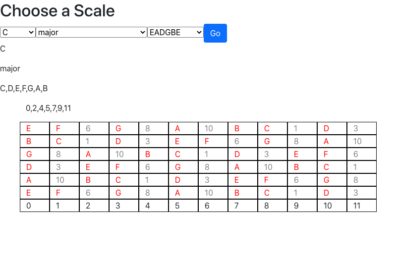

    <h1>Fretboard Scales</h1>
 
This is a work in progess of an app for musicians where the user will be able to
view scales on a fretboard based the users selection and tuning. Currently able to view a good amount of scales on a
handful of different tunings.
 
[Web App](https://andysanchez726.github.io/fretboard-scale-app/)

    <h1>Credits</h1>

Javascript Library - [TonalJS](https://github.com/tonaljs/tonal)
  

 
 

    <h1>Questions</h1>

If you have any questions, here is a link to my github as well as my email address. Feel free to contanct me!

[Github](github.com/andysanchez726 "My Github")

[Email](andysanchez726@gmail.com "My Email")
  

